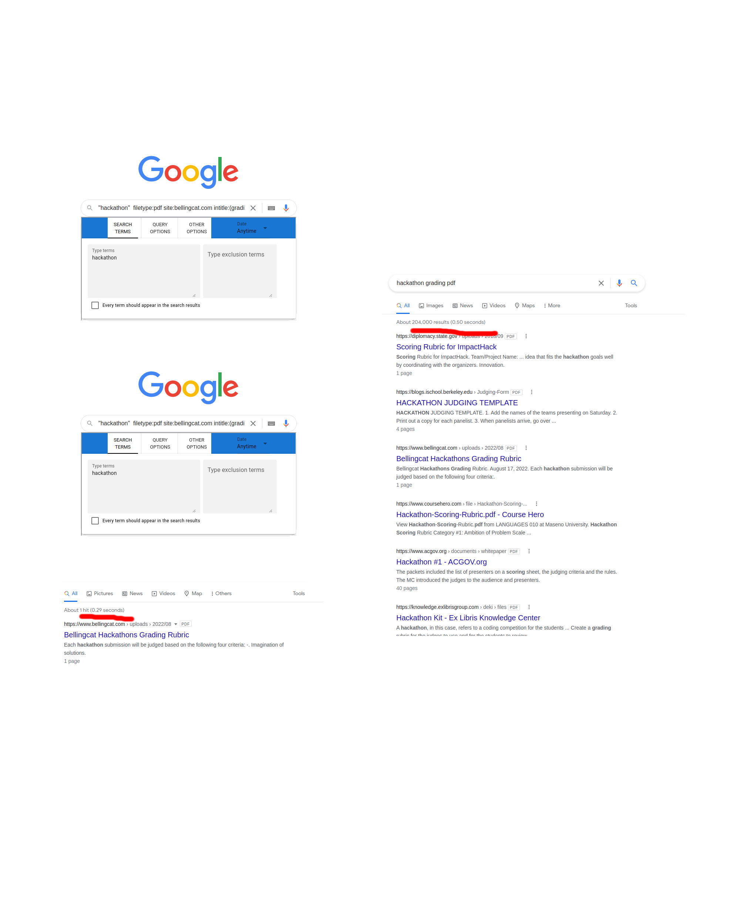

# Project name

## Team Members

[pbkompasz](https://github.com/pbkompasz)  

## Tool Description

This tool allows the general user to optimize their Google searches.
Google provides search operators that allow optimal searches,
however these operators are complicated to use and hard to memorize.

The purpose of this tool is to enable any user to perform searches that lead to
better results and faster response times.



[demonstration.webm](https://user-images.githubusercontent.com/47194071/192139663-9a4438a8-3065-44bd-bf6d-fd7177f28522.webm)


## Installation

Make sure you have [Node.js version 16.17 or greater](https://nodejs.org/en/)
, the latest version of [npm](https://docs.npmjs.com/downloading-and-installing-node-js-and-npm)
and the latest version of [Chrome](https://www.google.com/chrome/?brand=JJTC&gclid=Cj0KCQjw1bqZBhDXARIsANTjCPJEGZ1sPcQM2qcfMkXQnb_1siThmJUBc2JvRyXpKNQ2Py1bWEoEUTQaAsK-EALw_wcB&gclsrc=aw.ds)
installed.

### Download the tool's repository using the command:

```
git clone https://github.com/pbkompasz/search
```

### Load latest version

Follow the instruction [here](https://support.google.com/chrome_webstore/answer/2664769?hl=en) to load the extension from ```dist/bex ``` into your browser.


### Build locally

```
cd ui   
npm i
npm run dev
```

Follow the instruction [here](https://support.google.com/chrome_webstore/answer/2664769?hl=en) to load the extension from ``` ui/dist/bex ``` into your browser.

## Usage

If you visit google.com or google.com/search the GUI will appear under
the search input. You can customize your search by modifying some
of the inputs.
